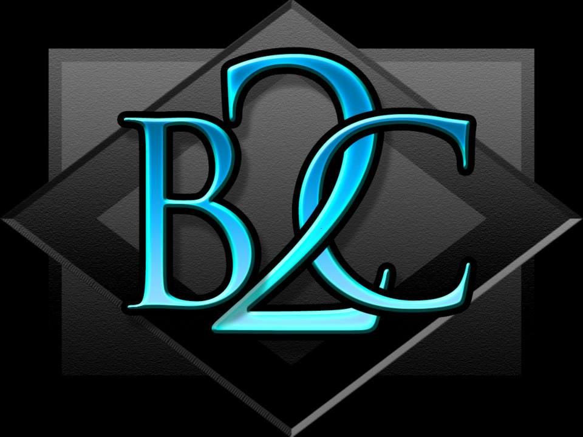

## About the App

This is a blog App made in Laravel. The Admin can create, view and edit the post. While user can view it and comment as well.

## Dependencies and Installation

After cloning the Project. Run "composer install" in your terminal(without qoutes). Be sure to change directory to Laravel-Blog-App.  
If .env file is not generated then create one and copy the content from .env.example and run "php artisan key:generate" (without qoutes).  

## Building and Running

For database feature to take effect, you need to have database in your system(mysql, sqlite, etc.)  
Make sure to create a database  
Run "mysql -u root -p" (or whatever username u have)  
Then Enter Password:  
create database database_name;  
above cmd will create database with name given   
For mysql enter following in env file  
DB_CONNECTION=mysql  
DB_HOST=127.0.0.1  
DB_PORT=3306  
DB_DATABASE=database_name   
DB_USERNAME=database_username  
DB_PASSWORD=database_password  
Then run "php artisan migrate" in your terminal.  
For Password reset feature and mail to take place enter following in .env file  
MAIL_DRIVER=smtp  
MAIL_HOST=smtp.gmail.com  
MAIL_PORT=587  
MAIL_USERNAME=your_user_name(gmail)  
MAIL_PASSWORD=your_gmail_password  
MAIL_ENCRYPTION=tls  

Run "php artisan serve" in terminal  

## For Admin Regisration

Run "php artisan tinker"  
And type following:  
$admin=new App\Admin  
$admin->name="user_name"  
$admin->email="your email" (make sure to enter valid email, in case u forgot ur password it will help)  
$admin->password=Hash::make('your_password')  
$admin->job_title="job_title"  
$admin->save()  
